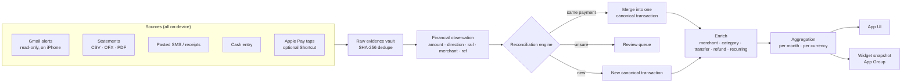
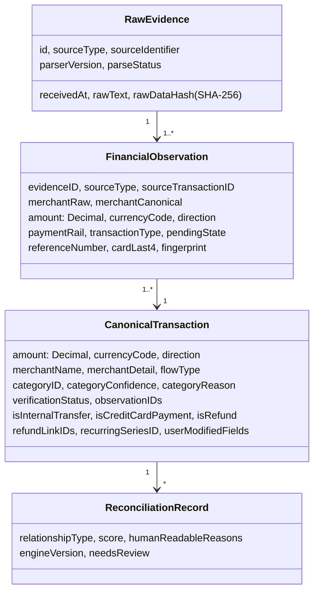
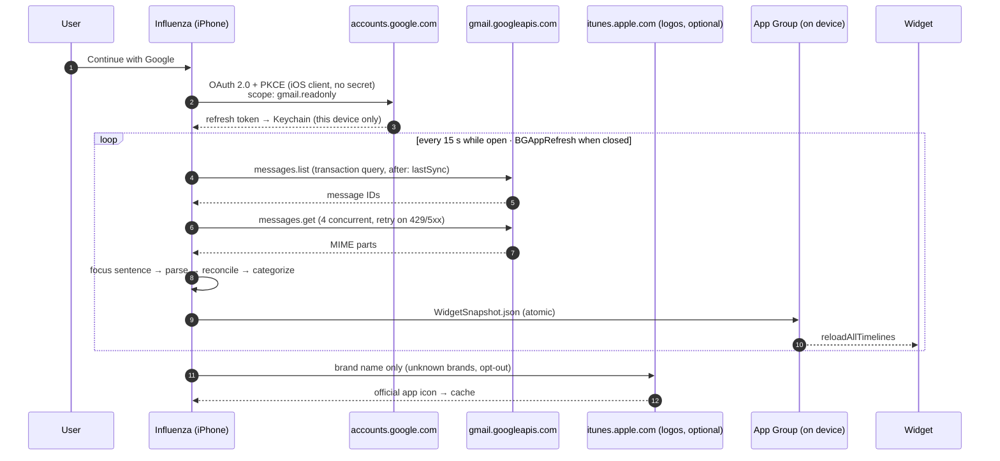

<p align="center">
  
</p>

<h1 align="center">Influenza</h1>

<p align="center">
  <b>Where did my money actually go?</b><br/>
  A privacy-first iOS money ledger that reconstructs your real spending from the alerts your bank already sends you —
  automatically, on your iPhone, with no bank login, no AI and no server.
</p>

<p align="center">
  
  
  
  
  
  
  
</p>

---

## Contents

1. [The problem](#1-the-problem)
2. [What Influenza does](#2-what-influenza-does)
3. [Screenshots](#3-screenshots)
4. [How it works — in one picture](#4-how-it-works--in-one-picture)
5. [Architecture](#5-architecture)
6. ["Backend" architecture (there is no server — by design)](#6-backend-architecture-there-is-no-server--by-design)
7. [Privacy & security model](#7-privacy--security-model)
8. [Installation](#8-installation)
9. [Testing & measured accuracy](#9-testing--measured-accuracy)
10. [Project structure](#10-project-structure)
11. [Honest platform limits](#11-honest-platform-limits)
12. [Roadmap](#12-roadmap)
13. [Credits & third-party notices](#13-credits--third-party-notices)
14. [License](#14-license)

A deeper, file-by-file walkthrough of the engine lives in **[docs/ARCHITECTURE.md](docs/ARCHITECTURE.md)**.

---

## 1. The problem

Money now moves through too many rails for anyone to keep track of it:

- **UPI apps** — PhonePe, Google Pay, Paytm, CRED, BHIM, POP, Kotak811 …
- **Credit and debit cards** — online, tap-to-pay, Apple Pay, international
- **Bank transfers** — NEFT, IMPS, RTGS, ACH, Zelle
- **Cash**

Every one of these produces its own records, and a single purchase often produces **several**:

```
You pay ₹1,299 at Amazon with your credit card
  ├── Bank SMS         "Rs.1,299 spent on HDFC Card xx1234 at AMAZON"
  ├── Bank email       "Thank you for using your HDFC Bank Credit Card…"
  ├── Merchant email   "Your Amazon order… Total paid ₹1,299"
  └── Card statement   "12/09/2026  AMAZON PAY INDIA  1,299.00"
```

Existing trackers get this wrong in predictable ways:

| Failure | Consequence |
|---|---|
| Treat every record as a new expense | The same ₹1,299 is counted 2–4× |
| Count credit-card bill payments as spending | You "spend" your purchases twice — once on the card, again when you pay the card |
| Count ATM withdrawals as spending | Cash taken out looks like cash spent |
| Categorize by a static merchant table | "Amazon" is always "Shopping" — even when you bought a book, groceries or a laptop |
| Require bank logins / aggregators | Privacy risk, paid APIs, geography-locked |
| Use a cloud LLM to read your messages | Your financial messages leave your phone |

This was independently validated as the highest-scoring unsolved consumer problem (*itch score 90.5*) on Razorpay's *Fix My Itch* database.

## 2. What Influenza does

> **Open the app → sign in with Google once → everything is tracked automatically. You only add cash.**

- **Automatic capture** — reads **only transaction emails** (bank, card, UPI and merchant alerts) from your Gmail, **on the iPhone**, read-only. Twelve months of history on first run; checks every 15 seconds while the app is open, and in the background whenever iOS allows.
- **One real transaction, not four records** — a reconciliation engine merges the SMS, email, receipt and statement for the same payment into one *canonical transaction*, and explains why.
- **Correct money semantics** — credit-card bill payments, transfers to your own accounts and ATM withdrawals are **never counted as spending**; refunds are linked back to the purchase they reverse.
- **Money out, split honestly** — *spent on things* vs *sent to people* (family, friends), both visible.
- **Deep categories & brands** — Food → Delivery → Swiggy ₹4,200 · 14 payments; marketplaces (Amazon, Flipkart, Walmart) categorized by *what you bought* when a receipt is available.
- **People** — see how much you sent to (or received from) each person; tag Mom as *Family* once and every future payment follows.
- **Subscriptions** — the same amount to the same merchant every month is detected and labelled.
- **Month-first insights** — every number belongs to a month; compare with last month, your 3-month and 6-month average.
- **Real brand logos** — 88 official brand icons bundled in the app; any other brand worldwide gets its App Store icon (strict name match, cached, opt-out).
- **Home & Lock Screen widget** — money out, top categories with animated share bars, change vs last month; amounts hidden on the Lock Screen.
- **Statement import** — CSV, OFX/QFX and PDF (PDFKit + on-device OCR) for backfilling history; idempotent.
- **Transparent** — every transaction shows its evidence, why it was categorized, and why it was merged; *Settings → Recent emails* shows what happened to every email checked.
- **No backend, no LLM, no analytics SDK, no bank password.**

## 3. Screenshots

> Screenshots live in [`docs/screenshots/`](docs/screenshots/). To regenerate them with demo data, run the app in a simulator, open **Settings → Developer → Seed India demo**, and capture Home (Categories / Brands / People / Trend), a category page and the widget.

| Home | Category → Brands | People | Widget |
|---|---|---|---|
| _docs/screenshots/home.png_ | _docs/screenshots/category.png_ | _docs/screenshots/people.png_ | _docs/screenshots/widget.png_ |

## 4. How it works — in one picture



## 5. Architecture

### 5.1 Layers

```mermaid
flowchart TB
    subgraph App["Influenza (iOS app target)"]
        V[SwiftUI views<br/>Home · Transactions · Review · Settings]
        ST[LedgerStore<br/>@Observable façade / use cases]
        SRC[Sources<br/>GmailSource · GoogleAuth · statement import · OCR]
        DS[Design system<br/>CRED-style tokens · NeoPOP controls · BrandLogo]
        REPO[LedgerRepository<br/>encrypted JSON, atomic writes]
    end
    subgraph Core["LedgerCore (Swift package — no UI, no I/O)"]
        PARSE[Parsing<br/>messages · emails · receipts · amounts]
        STMT[Statements<br/>CSV · OFX · PDF text]
        REC[LedgerEngine<br/>dedupe · match · transfers · refunds]
        INT[Intelligence<br/>merchants · categories · recurring · brands]
        AGG[AggregationService]
    end
    subgraph Widget["InfluenzaWidget (WidgetKit extension)"]
        WV[Widget views]
    end
    V --> ST
    ST --> REC
    SRC --> ST
    ST --> REPO
    REC --> PARSE & STMT & INT
    ST --> AGG
    ST -- WidgetSnapshot JSON --> AG[(App Group container)]
    AG --> WV
```

- **`LedgerCore`** is a pure Swift package. It never touches the network, the disk or UIKit, so it is deterministic and fully testable on macOS (`swift test`, no simulator).
- **The app** owns sources (Gmail, files), persistence and UI. Views never parse or persist — they call use cases on `LedgerStore`.
- **The widget** is a read-only consumer of a small, derived snapshot written atomically to the App Group container.

### 5.2 The domain model — evidence is not an expense



- **Money is always `Decimal`** — never `Double`. Currencies are never summed without an explicit FX rate.
- **Evidence trust levels** — 1 authoritative feed · 2 statement · 3 receipt · 4 alert (SMS/email/wallet) · 5 user input. Lower-trust evidence can enrich a transaction but never silently changes an authoritative amount.
- **Verification** — `verified` (a statement/feed confirms it), `detected` (seen in an alert), `userEntered` (cash), `pendingReview`.

### 5.3 The reconciliation engine

For every new observation:

1. **Same-source dedupe** — by `source + sourceTransactionID` (e.g. OFX `FITID`), else by a stable fingerprint (source, account, day, amount, currency, normalized merchant, rail, reference, card, occurrence ordinal). Re-importing the same statement adds **zero** rows; two genuine identical coffees on one statement are both kept.
2. **Pending → posted** — a posted record claims its pending twin.
3. **Receipts** enrich the matching transaction (merchant detail, line items) — never its amount.
4. **Cross-source match** — candidates share currency, direction and exact amount within a 3-day (5 for statements) window, and never come from the same source type. Each is scored:

   | Signal | Weight |
   |---|---|
   | Same reference number (e.g. UPI RRN) | +0.50 |
   | Same amount | +0.30 |
   | Same currency | +0.05 |
   | Same canonical merchant | +0.35 |
   | Similar merchant name | +0.15 |
   | Within 24 h / 72 h / 5 days | +0.15 / +0.08 / +0.04 |
   | Same card/account last-4 | +0.10 |
   | Compatible payment rail | +0.05 |
   | Different reference, different card, or two *different known* merchants (Amazon ≠ Target) | **hard reject** |

   **≥ 0.88 → merge · 0.50–0.88 → review queue · < 0.50 → separate.** Weights were tuned against the fixture suite; a wrong merge is worse than a review card.
5. **Transfers** — opposite-direction pairs between your own accounts, credit-card bill payments (including via CRED), and payments to *your own name* become internal transfers (excluded from spending).
6. **Refunds** — linked to the purchase by merchant + amount, or by amount + card when the reversal names no merchant; net spending drops accordingly.
7. **Recurring** — monthly/weekly/quarterly/annual cadence detection; identical monthly charges become *Subscriptions*.

Every decision is written as a `ReconciliationRecord` with human-readable reasons (*"Same reference number · Same amount · Within a day"*), shown on the transaction detail screen.

### 5.4 Parsing without an LLM

- **Bank-agnostic classifier** — rejects OTPs, bill-due reminders, mandates, declined/failed transactions, collect requests, promotions and login alerts before anything else.
- **Amounts worldwide** — `₹ Rs INR $ € £ ¥ R$ A$ …`, `1,23,456.00`, `1.234,56`, `(42.18)`, `1'234.50`; balances and limits are skipped.
- **Email focusing** — a bank email wraps one transaction sentence in greetings, security warnings ("never share your OTP") and loan ads. Influenza extracts only the sentence around the money movement, then requires *transactional* wording ("debited from your account", "spent on your card", "receipt from") so newsletters that merely mention money are rejected.
- **Merchant extraction** — prioritized patterns for real formats (`VPA x@bank (NAME)`, `at UPI/NAME`, `towards NAME through`, `; NETFLIX credited`, `Cr-…-NAME-`), boilerplate-proof ("to view the below e-mailer" is not a merchant), bank senders never used as merchants.
- **People vs shops** — UPI from a bank account to a person-looking payee (no business words, non-merchant VPA) is *sent to people*; RuPay-credit-card UPI is merchant-only by design, so it stays a purchase.
- **Who is "you"?** — bank greetings ("Dear Priya", "Hello Rahul Kumar") are counted to learn the account holder's name, so transfers to yourself are recognised.

### 5.5 Categorization

`user rule → transaction type → receipt items → merchant dictionary → whole-word keywords → local-payment fallback → unknown`

- ~120 bundled merchant aliases (India + US), marketplace-aware: Amazon/Flipkart/Walmart/Target get **low confidence** unless receipt items say otherwise (*MacBook → Electronics, detergent + soap → Personal Care, milk + eggs → Groceries*, mixed baskets stay *General*).
- Data-driven category tree: Food, Transport, Shopping, Bills (incl. Software & apps, Subscriptions), Entertainment (incl. Sports & games), Health, Education, **People** (Family, Friends, Sent to people), Financial, Income, Other.
- "Always categorize this merchant this way" rules apply to past and future transactions and are kept across re-processing.

## 6. "Backend" architecture (there is no server — by design)

Influenza's backend is **the iPhone**. The only network calls are to Google's and Apple's own APIs.



| Concern | How it is handled |
|---|---|
| **Auth** | OAuth 2.0 authorization-code flow with PKCE via `ASWebAuthenticationSession`; no client secret, no Google SDK. Refresh token in the Keychain (`AfterFirstUnlockThisDeviceOnly`). Handles `invalid_grant` (Testing-mode apps expire refresh tokens weekly) with a *Reconnect Gmail* prompt. |
| **Sync** | Server-side Gmail query narrows to transaction-looking mail and excludes Promotions/Social. Incremental `after:` window with 2-day overlap. Owned sync task (pull-to-refresh can't cancel it halfway). Failed downloads retried with backoff and remembered; an email that fails 3 syncs is set aside instead of blocking. |
| **Idempotency** | Gmail message IDs + evidence SHA-256 hashes + observation fingerprints — the same email can never create two transactions. |
| **Re-processing** | Raw evidence (the focused payment sentence + sender) is kept, so improving the parser re-runs locally and deterministically (`parserVersion` bump triggers it automatically). |
| **Persistence** | `LedgerState` (Codable) → encrypted JSON with atomic writes and iOS Data Protection. Backward-compatible decoding so older ledgers always open; a corrupt file is quarantined, never silently discarded. |
| **Widget** | App Group container holds only a small derived `WidgetSnapshot` (totals, top categories, top brand logos). The widget never reads the ledger. |
| **Background** | `BGAppRefreshTask` (iOS decides cadence — typically a few times a day) + foreground polling every 15 s. |

**Future connectors plug into the same pipeline** without changing the ledger — e.g. an *India Account Aggregator* source (mobile number + OTP consent) designed so the decryption key is generated on the iPhone and any relay only ever forwards ciphertext; or *FinanceKit* where Apple grants the entitlement.

## 7. Privacy & security model

| | |
|---|---|
| Financial data | Stored only on the iPhone, encrypted by iOS Data Protection |
| Gmail | Read-only scope; read on the device; only the one payment sentence of a payment email is kept |
| AI / LLM | **Not used** — deterministic, versioned rules |
| Server / cloud copy | **None** |
| Bank passwords | Never asked for |
| Analytics, crash, ad SDKs | None included |
| Logs | `OSLog` with private interpolation; no transaction text is ever logged |
| App lock | Face ID / Touch ID with device-passcode fallback, re-locks on background |
| Widget | Totals only; amounts are `privacySensitive` (hidden on the Lock Screen) |
| Brand logos | 88 bundled (no network). Unknown brands: shop name only sent to Apple's App Store search; names of people never looked up; can be turned off |
| Export / delete | CSV & JSON export; one-tap delete of everything |

## 8. Installation

### Requirements

- macOS with **Xcode 26+** (developed on Xcode 27, iOS 27 SDK)
- An iPhone on **iOS 26+** (Liquid Glass APIs)
- [XcodeGen](https://github.com/yonaskolb/XcodeGen) — `brew install xcodegen`
- A free Apple ID (*Personal Team* signing works — including the widget's App Group)
- A Google Cloud project for Gmail sign-in (free)

### 1 — Clone and configure

```bash
git clone https://github.com/<you>/influenza.git
cd influenza
cp Config/Local.xcconfig.example Config/Local.xcconfig
```

Edit `Config/Local.xcconfig` (it is git-ignored):

```xcconfig
DEVELOPMENT_TEAM = YOUR_TEAM_ID            // Xcode → Settings → Accounts
GOOGLE_IOS_CLIENT_ID = 1234-abc.apps.googleusercontent.com
```

### 2 — Create the Google OAuth client (5 minutes, free)

1. [console.cloud.google.com](https://console.cloud.google.com) → **New project**.
2. **APIs & Services → Library → Gmail API → Enable**.
3. **OAuth consent screen / Google Auth Platform** → *External* → fill app name and emails.
4. **Audience → Test users** → add the Gmail account(s) you'll use.
5. **Data access → Add scopes** → `.../auth/gmail.readonly`.
6. **Clients → Create client → iOS**, bundle ID `com.chaitanyasai.influenza` (or your own — change it in `project.yml` too).
7. Paste the client ID into `Config/Local.xcconfig`.

> In *Testing* mode Google expires refresh tokens after 7 days; the app shows **Reconnect Gmail** when that happens. Publishing an app that uses a restricted Gmail scope requires Google's verification and security assessment.

### 3 — Generate the project and run

```bash
xcodegen generate
open Influenza.xcodeproj
```

Select your iPhone and press **⌘R**. On first install: iPhone *Settings → Privacy & Security → Developer Mode → On*, and *Settings → General → VPN & Device Management →* trust your Apple ID.

Free-signed builds expire after 7 days — press ⌘R again to reinstall (your data is kept).

### 4 — Add the widget

Long-press the Home Screen → **Edit → Add Widget → Influenza** (small, medium, large, Lock Screen).

## 9. Testing & measured accuracy

```bash
cd Packages/LedgerCore
swift test --skip PerformanceTests          # 51 tests, < 1 s
swift test -c release --filter PerformanceTests
```

| Suite | What it covers |
|---|---|
| `ReconciliationTests` | The 8 mandatory cases — same purchase from two sources, internal transfer, refund nets to zero, pending→posted, SMS + statement verified, equal amounts at different merchants stay separate, ATM not spending, double import idempotent — plus currency isolation, UPI-reference merge, ambiguous → review, cash never merged |
| `ParserTests` | India + US alert corpus with varied wording; OTP / due / declined / collect-request rejection; messy merchant strings (`AMZN MKTP US*123`, `DD*ORDER123`, `WHOLEFDS MKT #102`); worldwide amount formats |
| `IndianEmailFixtureTests` | Anonymized real formats from Kotak, HDFC, AU, CRED and merchants — boilerplate-proof merchants, CRED as card bill, UPI to a person, forex-markup alerts, invoice totals, newsletter rejection, reversal linking, bank sender never a merchant, People & Family, self-transfers, subscriptions |
| `CategorizationTests` | Marketplace-by-items (Amazon, Walmart, Target), Uber vs Uber Eats, receipt enrichment, user rules, labelled accuracy set |
| `StatementTests` | Indian bank CSV with preamble + debit/credit columns, European `;` CSV, Amex positive-purchase convention, OFX/QFX with FITID idempotency, PDF text |
| `MonthlyTests` · `RecurringTests` | Month separation, subscriptions |
| `PerformanceTests` | 10k / 50k statement rows |

**Measured results**

| Metric | Result |
|---|---|
| Parser fixture accuracy | **24 / 24 (100%)** |
| Category accuracy (labelled merchants) | **39 / 40 (97%)** |
| Replay of 309 real emails (developer's own inbox, local only) | uncategorized **185 → 1**; 37 newsletters/marketing rejected |
| Import speed (release) | **10k rows 1.2 s · 50k rows 6.3 s**; re-import adds 0 |
| Month aggregation | 15 ms at 10k transactions |

> Accuracy numbers are measured on the fixture corpus and one real inbox — not a claim about every bank everywhere. `ReplayTests` lets you replay your own exported ledger locally (`LEDGER_REPLAY=/path/to/ledger.json swift test --filter ReplayTests`); it is skipped by default and no personal data is committed.

## 10. Project structure

```
influenza/
├── project.yml                     # XcodeGen spec (app + widget + packages)
├── Config/
│   ├── Base.xcconfig
│   └── Local.xcconfig.example      # team ID + Google client ID (copy → Local.xcconfig)
├── Packages/LedgerCore/            # pure Swift engine — no UI, no I/O
│   ├── Sources/LedgerCore/
│   │   ├── Domain/                 # Money, evidence, observations, canonical tx, categories
│   │   ├── Parsing/                # FinancialMessageParser, EmailAlertExtractor, AmountParser, ReceiptParser
│   │   ├── Statements/             # CSV, OFX/QFX, PDF-text parsers
│   │   ├── Intelligence/           # MerchantResolver, BrandCatalog, CategorizationEngine, RecurringDetector
│   │   └── Engine/                 # LedgerEngine (reconciliation), LedgerState, AggregationService
│   └── Tests/LedgerCoreTests/      # 51 tests + performance + local replay
├── Influenza/                      # iOS app
│   ├── App/                        # entry point, root view, tab bar
│   ├── Store/                      # LedgerStore façade, insight queries, widget snapshot writer
│   ├── Sources/                    # GoogleAuth (PKCE), GmailSource (sync, retries, diagnostics)
│   ├── Features/                   # Home, Insights, Transactions, Detail, Review, Import, Cash, Settings…
│   ├── DesignSystem/               # CRED-style tokens, NeoPOP wrappers, BrandLogo, components
│   ├── Security/                   # AppLock, Keychain, SafeLog
│   ├── Intents/                    # optional App Intents (Shortcuts)
│   └── Resources/                  # Info.plist, entitlements, assets (88 brand logos)
├── InfluenzaWidget/                # WidgetKit extension
├── Shared/                         # WidgetSnapshot + shared UI helpers (app + widget)
└── docs/                           # architecture deep-dive, images, screenshots
```

## 11. Honest platform limits

- **iOS apps cannot read SMS or other apps' notifications.** Influenza reads the *email* alerts banks send instead. A bank that only sends SMS for a payment type won't be captured until you turn on email alerts (or paste the SMS / import a statement).
- **Background time is rationed by iOS.** Near-instant while the app is open (15 s); when closed, iOS wakes the app only a few times a day.
- **Widgets animate only when their data changes** — no widget can run continuous animation.
- **Gmail restricted scope** — fine for personal use and up to 100 test users; public distribution needs Google verification.
- **FinanceKit** needs an Apple-granted entitlement and an organization account; the adapter is designed but inactive.
- **Account Aggregator (India)** requires a registered entity and a licensed partner; designed as a future source.

## 12. Roadmap

- [ ] India Account Aggregator source (device-held keys, ciphertext-only relay)
- [ ] SwiftData repository for 100k+ ledgers
- [ ] Share Extension ("Share SMS → Influenza")
- [ ] FinanceKit source where available
- [ ] Budgets & alerts (describe, don't judge)
- [ ] Localization (en-IN, en-US, hi-IN)
- [ ] Full accessibility audit

## 13. Credits & third-party notices

- **[NeoPOP iOS](https://github.com/CRED-CLUB/neopop-ios)** by CRED — Apache License 2.0. Used for the floating shimmer button, 3D buttons and switch. Colour and typography choices are inspired by CRED's public NeoPOP design system.
- **Brand logos** are trademarks of their respective owners, taken from each brand's public App Store listing and used only to identify merchants inside the app. Remove `Influenza/Resources/Assets.xcassets/Brands` before redistributing if you don't have the right to use them.
- Built with Swift, SwiftUI, Swift Charts, WidgetKit, Vision, PDFKit, AuthenticationServices and CryptoKit.

## 14. License

Copyright © 2026 **Chaitanya Sai**.

Licensed under the **[Apache License 2.0](LICENSE)** — see [NOTICE](NOTICE). You may use, modify and distribute this code, provided you keep the copyright notice, the LICENSE and the NOTICE file, and state significant changes. The **Influenza name and icon are not licensed** (no trademark rights are granted), and third-party brand logos are excluded from the license.

---

<p align="center"><sub>Describe, don't judge. Your money, finally in one place.</sub></p>
