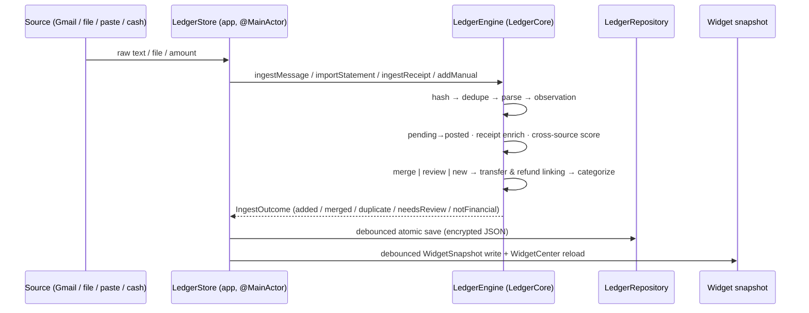
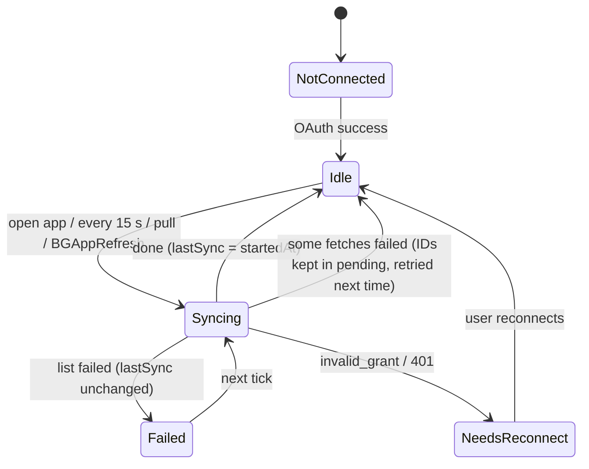

# Influenza — Architecture deep-dive

This document explains how Influenza turns fragmented financial evidence into one trustworthy ledger, entirely on the iPhone. It complements the [README](../README.md).

- [1. Design principles](#1-design-principles)
- [2. Targets and modules](#2-targets-and-modules)
- [3. Data flow, end to end](#3-data-flow-end-to-end)
- [4. LedgerCore, file by file](#4-ledgercore-file-by-file)
- [5. The app, file by file](#5-the-app-file-by-file)
- [6. Sync engine (Gmail)](#6-sync-engine-gmail)
- [7. Persistence, migration and re-processing](#7-persistence-migration-and-re-processing)
- [8. Widget pipeline](#8-widget-pipeline)
- [9. Concurrency model](#9-concurrency-model)
- [10. Extending: adding a new source, bank or country](#10-extending-adding-a-new-source-bank-or-country)
- [11. Decision log](#11-decision-log)

---

## 1. Design principles

| Principle | Consequence in code |
|---|---|
| **Evidence is not an expense** | Four layers: `RawEvidence → FinancialObservation → CanonicalTransaction → ReconciliationRecord`. Nothing is counted until reconciliation decides what it is. |
| **Correctness > automation** | Uncertain matches go to a review queue; a wrong merge is worse than a review card. |
| **Source truth > inference** | Lower-trust evidence never mutates an authoritative amount. Money is `Decimal`. |
| **Local > cloud** | No backend. The only network calls are Google OAuth, the Gmail API and (optionally) Apple's App Store search for logos. |
| **Deterministic core** | Same input + same engine version → same ledger. No LLM, no randomness; every rule is versioned (`parserVersion`, `rulesVersion`, `engineVersion`). |
| **Explainable** | Every merge, transfer, refund and category carries human-readable reasons. |
| **Describe, don't judge** | UI copy says "₹2,340 more than last month", never "you overspent". |

## 2. Targets and modules

| Target | Kind | Depends on | Responsibility |
|---|---|---|---|
| `LedgerCore` | Swift package (macOS + iOS) | Foundation, CryptoKit | Parsing, statements, reconciliation, categorization, recurring detection, aggregation. No UI, no disk, no network. |
| `Influenza` | iOS app | LedgerCore, NeoPop | Sources (Gmail, files, OCR), persistence, use cases (`LedgerStore`), SwiftUI, App Intents, widget snapshot writer. |
| `InfluenzaWidget` | WidgetKit extension | — | Renders `WidgetSnapshot` from the App Group container. |
| `Shared/` | source folder in both app targets | — | `WidgetSnapshot`, colour/format helpers. |

The project is generated by **XcodeGen** from `project.yml`; `Config/Local.xcconfig` (git-ignored) injects the team ID and Google client ID into the Info.plist.

## 3. Data flow, end to end

## 4. LedgerCore, file by file

### Domain
| File | Contents |
|---|---|
| `Money.swift` | `Money { amount: Decimal, currencyCode }`, stable decimal keys for fingerprints. |
| `Types.swift` | `EvidenceSourceType` with trust levels (1 feed … 5 user), `PaymentRail`, `ObservationTransactionType`, `FlowType`, `VerificationStatus`, account enums. |
| `Records.swift` | `RawEvidence`, `FinancialObservation`, `CanonicalTransaction`, `ReconciliationRecord`, `RecurringSeries`, `ImportJob`, `UserCategoryRule`. |
| `Categories.swift` | Data-driven category tree with stable dotted IDs (`food.delivery`, `people.family`, `bills.subscriptions`…). |
| `Hashing.swift` | SHA-256 (CryptoKit) for evidence integrity and dedupe. *A hash is not encryption.* |

### Parsing
| File | Contents |
|---|---|
| `AmountParser.swift` | Currency tokens worldwide, number formats (`1,23,456.00`, `1.234,56`, `(42.18)`), skips balances/limits, falls back to "debited by 250.0". |
| `FinancialMessageParser.swift` | Reject rules (OTP, due, mandate, declined, collect request, promo, login) → direction (with refund/reversal and merchant-perspective "we received your payment") → rail → type (card bill incl. CRED, ATM, self, salary, interest, cashback, strict fee rules, P2A/NEFT/IMPS, direct debit) → invoice totals → merchant extraction (prioritized patterns + stop-list) → P2P detection. |
| `EmailAlertExtractor.swift` | HTML → text; *focus* on the sentence around the first money verb, trimmed at sentence boundaries; `isTransactional` gate (positive wording required, marketing/status wording rejected). |
| `ReceiptParser.swift` | Merchant, "Restaurant:/Sold by:" detail, total (prefers grand total), line items. |
| `TextNormalization.swift`, `RX.swift` | Identifier stripping (VPAs, long digit runs), title-casing, compiled-regex cache (17× import speed-up). |

### Statements
| File | Contents |
|---|---|
| `CSVStatementParser.swift` | Delimiter detection, header detection that skips bank preambles, whole-word column matching (`cr` ≠ "des**cr**iption"), signed / debit+credit / type columns, Amex positive-purchase convention. |
| `OFXStatementParser.swift` | OFX 1.x SGML and 2.x XML, `FITID` as source transaction ID (idempotent across files). |
| `TextStatementParser.swift` | PDF-extracted text: date-prefixed lines with trailing amounts, Dr/Cr and running-balance direction inference. |
| `StatementRow.swift` | Format detection; day-first vs month-first inference from the whole column; 2-digit years; cached formatters with last-format preference. |

### Intelligence
| File | Contents |
|---|---|
| `MerchantResolver.swift` | ~120 aliases → canonical merchant + default category + marketplace flag; long aliases match glued names (`zomatofood`); result cache. |
| `MerchantNames.swift` | `looksLikePerson` (honorifics, business-word list, keyword check). |
| `BrandCatalog.swift` | Brand domain + colour for logos/monograms; monthly spending series. |
| `CategorizationEngine.swift` | Pipeline: user rule → type → receipt items (`ItemVocabulary`) → dictionary (marketplaces low-confidence) → whole-word `KeywordRules` → local-payment fallback → unknown. |
| `RecurringDetector.swift` | Median-gap cadence detection, amount-spread classification, next expected date. |

### Engine
| File | Contents |
|---|---|
| `LedgerEngine.swift` | Ingestion APIs, indexes (hash, source ID, fingerprint, amount), the reconciliation pipeline, scoring, transfer & refund linking, owner-name learning, subscriptions, user actions (merge/keep, set category, rename, mark transfer, ignore, delete), explanation API. |
| `LedgerState.swift` | Codable state with tolerant decoding (new fields default, old ledgers always open). |
| `AggregationService.swift` | Per-currency `PeriodSummary`: spent, sent to people, money out, moved, received, refunded, withdrew, fees, by category / subcategory / merchant; linked refunds net against the original category. |

## 5. The app, file by file

| Area | Files | Notes |
|---|---|---|
| Entry | `App/InfluenzaApp.swift`, `App/RootView.swift` | Composition root, light scheme, background refresh task, scene-phase handling (lock, polling start/stop). |
| Use cases | `Store/LedgerStore.swift`, `Store/InsightsQueries.swift` | `@Observable` façade over the engine; month windows ("so far" compares same number of days), comparisons (last month, 3- and 6-month averages), brands, people, widget snapshot. |
| Sources | `Sources/GoogleAuth.swift`, `Sources/GmailSource.swift` | PKCE OAuth; sync engine (see §6); recent-email diagnostics with "Add anyway". |
| Import | `Features/Import/*` | Statement picker (PDFKit + Vision OCR), paste alert with live preview, receipts (camera/photos/paste). |
| Insights | `Features/Home/*`, `Features/Insights/*` | CRED-style home: month hero, icon tabs (Categories/Brands/People/Trend), white sheet, category/brand/person drill-downs, spend meter, sync toast. |
| Ledger | `Features/Transactions/*`, `Features/Detail/*`, `Features/Review/*`, `Features/Recurring/*` | Timeline with month sections and search/filters; evidence and reasons; duplicate review; uncategorized queue. |
| Design | `DesignSystem/*` | Tokens (`Pop`), `MoneyText`, small-caps labels, dashed dividers, coin frames, 3D category icons, NeoPOP wrappers, `BrandLogo` + `LogoLookup`. |
| Platform | `Security/*`, `Intents/*` | Face ID lock, Keychain, private logging; optional Shortcuts actions. |

## 6. Sync engine (Gmail)

1. **Query** — transaction vocabulary (`debited OR credited OR spent OR "total paid" OR receipt …`) minus Promotions/Social, `newer_than:1y` on first run, else `after:<lastSync − 2 days>`.
2. **List** (≤ 5,000 first run / 1,000 incremental) ∪ previously failed IDs, minus processed IDs.
3. **Fetch** 4 at a time; retry only 429 / 5xx / network (0.5 → 1 → 2 s); permanent errors fail fast; an ID failing 3 syncs is set aside and shown in diagnostics.
4. **Process oldest first** (so refunds/transfers find earlier counterparts): learn owner name from the greeting → focus → ingest with sender as merchant hint → record diagnostic → mark processed.
5. **Finish** — persist processed/pending, `lastSync = startedAt`, reclassify self-transfers, refresh recurring, write widget snapshot, emit toast event.

The sync runs in a task **owned by `GmailSource`**; callers (pull-to-refresh, polling, background) join it rather than start a second one, and cancellation of a caller never stops it halfway.

## 7. Persistence, migration and re-processing

- **Storage** — `Application Support/Ledger/ledger.json`, written atomically with `completeFileProtectionUntilFirstUserAuthentication` (so the optional Shortcuts action can log while the phone is locked in a pocket).
- **Migration** — `LedgerState` decodes missing keys to defaults; a file that can't be decoded is renamed `ledger.corrupt-<timestamp>.json`, never deleted.
- **Re-processing** — when `FinancialMessageParser.version` changes, the app re-runs every stored evidence item through the new rules locally (keeping cash entries, user category rules and the learned owner name), then asks Gmail only for emails never seen before.
- **Planned** — a SwiftData repository for 100k+ ledgers; the engine is persistence-agnostic so this swap doesn't touch `LedgerCore`.

## 8. Widget pipeline

- The app writes `WidgetSnapshot` (money out, spent, sent to people, today, last-month-same-day, top 4 categories with colours/symbols, top 3 brands with 96-px logo copies, next recurring, review count) to `group.com.chaitanyasai.influenza` after every change (debounced 0.8 s) and on activation.
- The widget renders it with system-provided transitions: numbers roll (`numericText`), bars spring to new widths. Widgets animate only on timeline changes — iOS does not allow continuous animation.
- Amounts are `privacySensitive` → redacted on the Lock Screen while locked.

## 9. Concurrency model

- `LedgerEngine` is a plain class used from the main actor via `LedgerStore` (`@MainActor @Observable`). Ingestion is fast (≈0.12 ms/row) so UI never blocks noticeably; large imports can move to a background actor later.
- Network fetches run in child tasks (`withTaskGroup`); parsing and ledger mutation happen back on the main actor in a deterministic order.
- Disk writes are detached, debounced tasks.
- Regex and date-formatter caches are lock-protected static caches.

## 10. Extending: adding a new source, bank or country

| To add… | Do this | Don't |
|---|---|---|
| A bank's new alert wording | Add an anonymized fixture to `IndianEmailFixtureTests`/`ParserTests`, then adjust patterns in `FinancialMessageParser` | Special-case one bank in the engine |
| A merchant | One line in `MerchantResolver.entries` (+ `BrandCatalog` for colour/domain, + logo in `Assets.xcassets/Brands`) | Hard-code categories in views |
| A category | One node in `CategoryTree` | Touch aggregation |
| A statement format | A parser producing `[StatementRow]`, wired in `StatementDetector` | Bypass `importStatement` |
| A live source (Account Aggregator, FinanceKit, open banking) | An adapter that produces observations and calls the engine's ingestion APIs | Change the domain model |

## 11. Decision log

| Decision | Why |
|---|---|
| **No LLM** | Deterministic, testable, private, free; the amount must never depend on a model guess. |
| **Gmail on-device instead of email forwarding** | No server sees emails, no domain to buy, no forwarding rules for users. |
| **Shortcuts automation optional, not onboarding** | Zero-setup principle; ordinary users should never build automations. |
| **Tuned match weights (not the textbook 0.95 threshold)** | The spec's suggested weights failed its own mandatory tests (SMS + bank record scored 0.52); tuned against fixtures with hard rejects for conflicting identifiers. |
| **`detected` verification state** | Alerts are real but unconfirmed; without it every SMS would sit in review. |
| **Money out = spent + sent to people** | Users think of money given to family as "where it went"; kept as a separate figure so spending stays honest. |
| **Bundled + App Store logos** | Brand websites often block favicon requests or serve 16-px icons; App Store icons are square, high-res and recognisable. Bundled ones need no network at all. |
| **JSON store for now** | Simple, atomic, portable, easy to migrate; SwiftData planned for very large ledgers. |
| **Light CRED-style UI + NeoPOP controls** | Calm, premium, legible money; real NeoPOP components rather than an imitation. |
